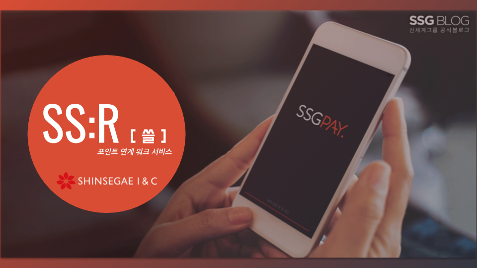
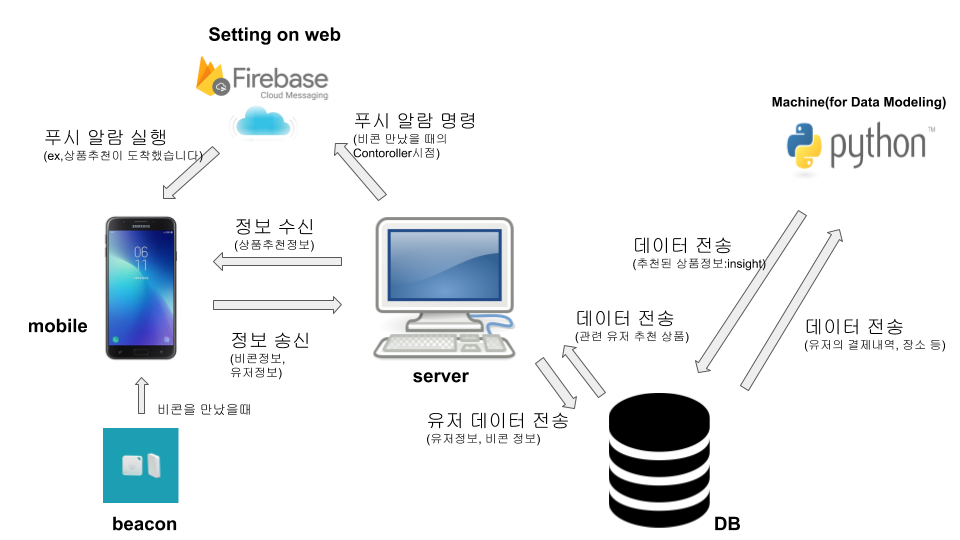
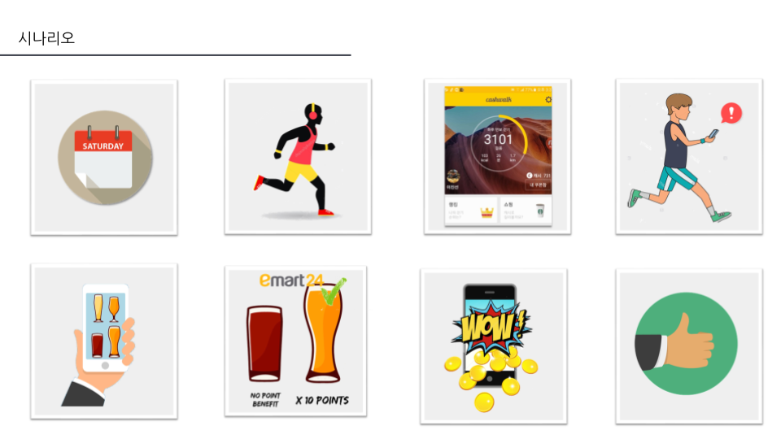

# SINC-INTERNSHIP-PROJECT
SINC INTERSHIP PROJECT SUBJECT:SSR

<table>
  <tr>
    <td>
     
    </td>
  </tr>
</table>

___
## Introduction
we propose how do our corporate get high-rated activation on our App, "SSG PAY"

## Requirements

- Python code for data modeling
- Mobile programming using android studio
- JAVA Spring code for MVC Pattern.
- STS(Spring Tool Suite) 4 ver.
- python *
- Beacon Processing

## Mobile Programming
- download program from this [link](https://developer.android.com/studio/?hl=ko) and put it in this project
- Need: mobile machine for testing.
## Beacon Processing
- Reference from this [link](https://ko.wikipedia.org/wiki/%EB%B9%84%EC%BD%98) and adjust it in this project
## Spring Framework Job
- download program from this [link](https://spring.io/tools) and put it in this project
## Python Modeling
- not yet
## DB Architecture
- not yet
## FireBase Cloud Messaging
- Reference from this [link](https://firebase.google.com/docs/cloud-messaging/?hl=ko) and adjust it in this project

## TODO
* Beacon purchasing
* Designing DB Architecture 
* Walking Service JAVA code
* Making UI StoryLine
* FRM Study
* Python-DB pipeline setup
* Spring-DB pipeline setup
* Android-Spring pipeline setup

## DONE
* Design Total StoryLine about Project:SSR
* Study Spring framework, JAVA
* Study Mobile Programming on Android studio.

## WORKFLOW 1: Processing in Store.

<table>
  <tr>
    <td>
     
    </td>
  </tr>
</table>

> Image

<table>
  <tr>
    <td>
      
    </td>
  </tr>
</table>
